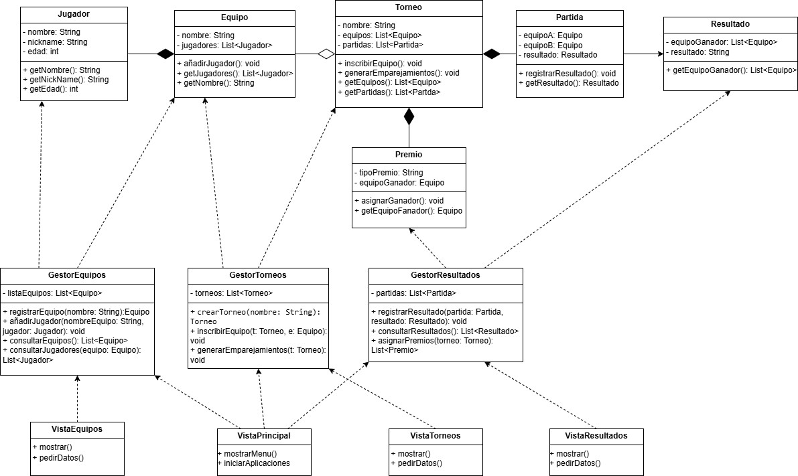

# Sistema de Gestión de Torneos de eSports

## Jesús Pastor Ricoy

## 1. Análisis del problema y requisitos del sistema

### Descripción general

El sistema que se va a desarrollar es una aplicación de gestión de torneos de eSports. Su finalidad es facilitar la organización completa de un torneo: desde el registro de los equipos y jugadores, hasta la creación del torneo, la inscripción de los participantes, la gestión de resultados de las partidas y la asignación de premios.

Este sistema debe ser utilizado principalmente por un Administrador, quien se encarga de la configuración, seguimiento y gestión de toda la información. Por otro lado, los Jugadores no gestionan datos, pero sí pueden consultar información relevante como equipos, jugadores, resultados y premios.

El modelado del sistema se realiza utilizando diagramas de casos de uso UML, los cuales ayudan a visualizar las principales funcionalidades desde la perspectiva de los actores que interactúan con él.

### ¿Quiénes son los actores que interactúan con el sistema?

#### 1. Administrador
- Es el actor responsable de todas las operaciones administrativas del sistema.
- Tiene acceso completo a todas las funcionalidades.
- Se encarga de registrar entidades, gestionar el desarrollo del torneo y asignar premios.

#### 2. Jugador
- Es un actor secundario, sin capacidad de modificación de datos.
- Su papel es únicamente consultivo: accede al sistema para visualizar información sobre su equipo, resultados y premios.
- No ejecuta acciones de gestión.

### ¿Cuáles son las acciones que cada actor puede realizar?

#### Acciones del Administrador:
- Registrar equipo: crea un nuevo equipo en el sistema.
- Añadir jugadores: vincula jugadores a equipos.
- Registrar jugadores: introduce los datos individuales de cada jugador.
- Consultar equipos: visualiza los equipos registrados.
- Consultar jugadores: visualiza los jugadores asociados a cada equipo.
- Crear torneo: da de alta un nuevo torneo.
- Inscribir equipos: añade equipos al torneo activo.
- Registrar resultados: guarda los resultados de las partidas jugadas.
- Consultar resultados: revisa los resultados ya registrados.
- Asignar premios: otorga premios a los equipos ganadores.
- Consultar premios: revisa los premios ya asignados.

#### Acciones del Jugador:
- Consultar equipos.
- Consultar jugadores.
- Consultar resultados.
- Consultar premios.

### ¿Cómo se relacionan entre sí las entidades del sistema?

- Un equipo está compuesto por uno o más jugadores (composición).
- Un torneo contiene varios equipos inscritos (agregación).
- Un torneo incluye varias partidas entre equipos (composición).
- Cada partida genera un resultado.
- Un premio se asigna a un equipo ganador al finalizar el torneo.

Relaciones funcionales entre casos de uso:
- "Registrar equipo" incluye "Añadir jugadores", que incluye "Registrar jugadores".
- "Consultar equipos" puede extenderse con "Consultar jugadores".
- "Crear torneo" incluye "Inscribir equipos".

## 2. Identificación de los casos de uso y elaboración del diagrama

### Objetivo

Se identifican las interacciones clave entre los actores y el sistema, agrupadas por áreas funcionales. El diagrama de casos de uso UML representa estas interacciones utilizando <<include>> y <<extend>>.

### Actores del sistema
- **Administrador**: gestiona equipos, jugadores, torneos, partidas y premios.
- **Jugador**: solo consulta información pública.

### Casos de uso agrupados

#### Gestión de equipos y jugadores
- Registrar equipo
- Añadir jugadores a un equipo
- Registrar jugadores (<<include>> en "Añadir jugadores")
- Consultar equipos
- Consultar jugadores (<<extend>> de "Consultar equipos")

#### Gestión de torneos
- Crear torneo
- Inscribir equipos (<<include>> en "Crear torneo")

#### Gestión de partidas y resultados
- Registrar resultado
- Consultar resultados (independiente)

#### Gestión de premios
- Asignar premios
- Consultar premios

### Relaciones entre casos de uso
- Registrar equipo <<include>> Añadir jugadores <<include>> Registrar jugadores
- Consultar equipos <<extend>> Consultar jugadores
- Crear torneo <<include>> Inscribir equipos

## 3. Identificación de clases y relaciones

### Clases de entidad (Modelo)
- **Jugador**: nombre, alias, edad
- **Equipo**: nombre, lista de jugadores
- **Torneo**: nombre, lista de equipos y partidas
- **Partida**: equipoA, equipoB, resultado
- **Premio**: tipo, equipoGanador
- **Resultado**: puntuación, equipoGanador

### Clases de control
- **GestorEquipos**
- **GestorTorneos**
- **GestorResultados**
- **GestorPremios**

### Clases de interfaz (Vista)
- **VistaPrincipal**
- **VistaEquipos**
- **VistaTorneos**
- **VistaResultados**

### Relaciones entre clases
- Asociación: Equipo — Jugadores, Partida — Equipos
- Agregación: Torneo — Equipos
- Composición: Torneo — Partidas, Torneo — Premios
- Dependencia: Vistas → Controladores

)

## 4. Creación del diagrama de clases UML

### Estructura general

El diagrama se organiza siguiendo el patrón MVC:
- **Modelo** en la parte superior (entidades)
- **Controladores** en el centro
- **Vistas** en la parte inferior

### Contenido de las clases

Cada clase incluye:
- Atributos con visibilidad (`-` privado)
- Métodos públicos (`+`)
- Relaciones claras usando notación UML:
  - Asociaciones (línea)
  - Agregaciones (rombo blanco)
  - Composiciones (rombo negro)
  - Dependencias (línea discontinua)

El resultado es un diseño coherente, estructurado y listo para implementarse en Java.

## 5. Justificación del diseño

El diseño del sistema se ha basado en el patrón **Modelo-Vista-Controlador (MVC)** por ser una arquitectura ampliamente utilizada en el desarrollo de aplicaciones organizadas y escalables. Esta estructura permite separar de forma clara las responsabilidades:

- **El Modelo** gestiona los datos del dominio (jugadores, equipos, torneos, partidas, resultados y premios).
- **El Controlador** contiene la lógica de negocio, es decir, las operaciones necesarias para manipular y coordinar los datos del sistema.
- **La Vista** es la parte encargada de interactuar con el usuario, mostrando información y recogiendo entradas.

Esta separación no solo facilita el mantenimiento y la reutilización del código, sino que también mejora la organización del sistema, permite el trabajo en equipo de forma más eficaz (cada miembro puede encargarse de una capa) y favorece la implementación de futuras mejoras o ampliaciones.

Las clases han sido organizadas de forma jerárquica y coherente con los requisitos funcionales:

- **Clases de entidad**: representan las estructuras de datos principales del sistema, directamente derivadas del análisis de los casos de uso.
- **Clases de control**: se encargan de gestionar las acciones del sistema, respondiendo a las peticiones del usuario a través de las vistas.
- **Clases de interfaz**: organizadas según los módulos funcionales del sistema, permiten una navegación sencilla por el menú y cada apartado (equipos, torneos, resultados).

Las relaciones entre clases han sido seleccionadas con atención al significado lógico:
- **Composición** cuando un objeto depende por completo del otro (por ejemplo, Partidas dentro de un Torneo).
- **Agregación** cuando los elementos se agrupan pero pueden existir de forma independiente (Equipos en un Torneo).
- **Asociación** para conexiones directas simples (como Premio → Equipo).
- **Dependencia** entre vistas y controladores, reflejando el uso funcional sin acoplamiento fuerte.

Esta organización facilita la futura implementación en Java y garantiza que el sistema sea mantenible, modular y comprensible.

## 6. Conclusiones

La realización de este proyecto ha permitido aplicar de forma práctica los conocimientos adquiridos sobre **análisis de requisitos**, **modelado UML** y **estructura de software orientada a objetos**. A través del desarrollo del sistema se ha reforzado la importancia de diseñar correctamente antes de programar, utilizando herramientas como los **diagramas de casos de uso** y **diagramas de clases** para representar la lógica del sistema de forma visual y clara.

La adopción del patrón MVC ha sido especialmente útil para comprender cómo se pueden separar responsabilidades dentro de una aplicación, lo que mejora tanto su calidad como su mantenibilidad. Además, se ha practicado la elaboración de modelos realistas, con relaciones coherentes entre clases y con una orientación clara hacia su posterior implementación en código.

En definitiva, este trabajo no solo ha servido para afianzar conceptos teóricos, sino que también ha supuesto un paso más hacia el desarrollo profesional de aplicaciones bien estructuradas, modulares y alineadas con buenas prácticas de ingeniería del software.
